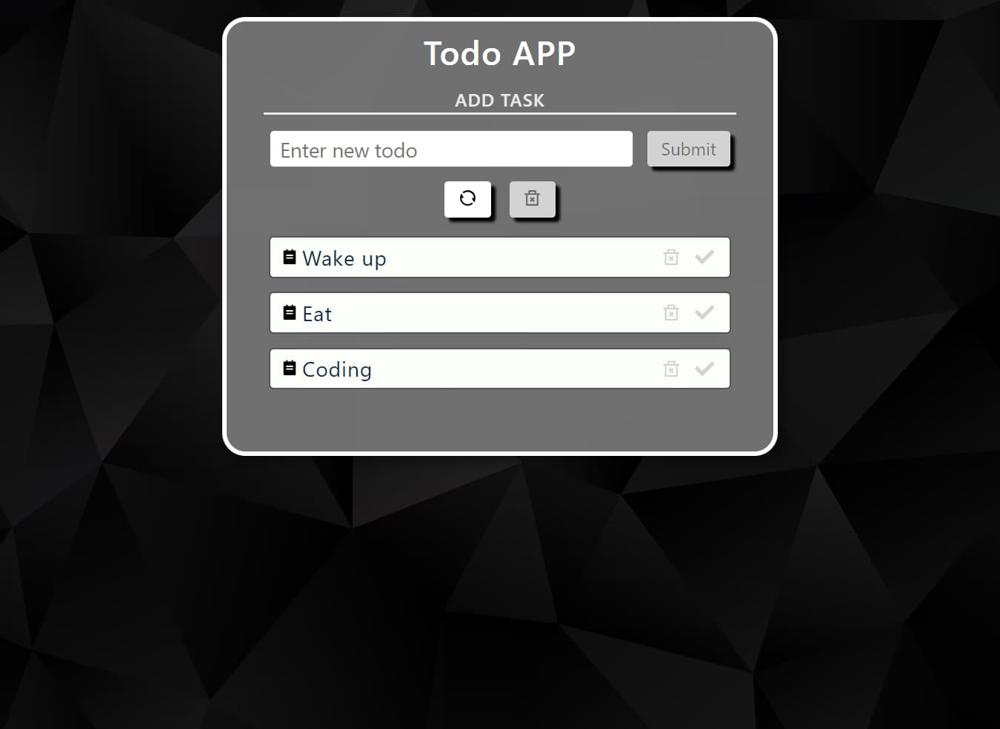

# **Todo App REACT :white_check_mark:**

**ToDo** is a great app for keeping yourself organized and on track with all the things that you have to do! It's very intuitive and easy to navigate..

💻 Deploy: [Link](https://w0x3r.github.io/TODO-APP/)

## Technology stack

:red_circle: HTML

:red_circle: SCSS

:red_circle: JavaScript (ES6)

:red_circle: REACT

:red_circle: Webpack 5

## Features

    ➖ Ability to add a task when you click on the ADD button.
    ➖ Checking for an empty string.
    ➖ Ability to mark a task as completed and save it to local storage.
    ➖ Ability to delete a task with the current to-do list saved in local storage.
    ➖ Ability to delete all to-do lists
    ➖ Possibility to delete only completed cases
    ➖ Displaying the number of completed cases

## Run the project locally:

To start working on the project on your local machine, please, make sure that you install [Git](https://git-scm.com/downloads) and [Node.js LTS](https://nodejs.org/en/download).

## Available Scripts

In the project directory, you can run:

### `npm start`

Runs the app in the development mode.\
Open [http://localhost:3000](http://localhost:3000) to view it in your browser.

The page will reload when you make changes.\
You may also see any lint errors in the console.

### `npm test`

Launches the test runner in the interactive watch mode.\
See the section about [running tests](https://facebook.github.io/create-react-app/docs/running-tests) for more information.

### `npm run build`

Builds the app for production to the `build` folder.\
It correctly bundles React in production mode and optimizes the build for the best performance.

The build is minified and the filenames include the hashes.\
Your app is ready to be deployed!

See the section about [deployment](https://facebook.github.io/create-react-app/docs/deployment) for more information.

### `npm run eject`

**Note: this is a one-way operation. Once you `eject`, you can't go back!**

If you aren't satisfied with the build tool and configuration choices, you can `eject` at any time. This command will remove the single build dependency from your project.

Instead, it will copy all the configuration files and the transitive dependencies (webpack, Babel, ESLint, etc) right into your project so you have full control over them. All of the commands except `eject` will still work, but they will point to the copied scripts so you can tweak them. At this point you're on your own.

You don't have to ever use `eject`. The curated feature set is suitable for small and middle deployments, and you shouldn't feel obligated to use this feature. However we understand that this tool wouldn't be useful if you couldn't customize it when you are ready for it.

### `npm run build` fails to minify

This section has moved here: [https://facebook.github.io/create-react-app/docs/troubleshooting#npm-run-build-fails-to-minify](https://facebook.github.io/create-react-app/docs/troubleshooting#npm-run-build-fails-to-minify)
